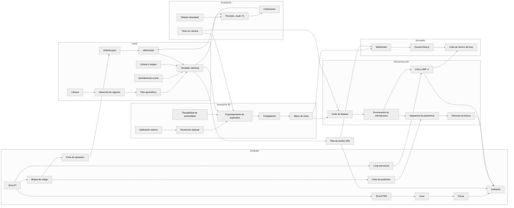

# SCuLPT Vision — markerless, multi-camera reconstruction

Reconstructs a SCuLPT program from one or more cameras pointed at the real
physical blocks (no markers), and runs it on the real SCuLPTER interpreter,
unmodified.

## Concept map

How the pieces relate, by domain. Solid arrows are "feeds into"; the full
map, with every concept explained, is the interactive
[docs/grafo-conceptos.html](docs/grafo-conceptos.html) (open it in a
browser; it needs internet for d3). A written overview is in
[docs/alcance.pdf](docs/alcance.pdf).



## Symbol recognition

Reference photos live in `referencias/`, seeded from the official renders
(`sembrar_referencias_desde_renders.py`). Each symbol is matched against a
bank of rotations (-40° to 40°) — plain matching breaks past ~20° of camera
rotation.

`simbolos.json` maps each reference photo to the lexeme it emits, and records
how the symbol is handwritten on the physical block (`↓` → `PUSH`, `+` →
`ADD`, `♡` → `heart`, …). Stack names must be ASCII identifiers because the
SCuLPTER lexer accepts nothing else, so `♡` becomes `heart` and `○` becomes
`circle`. Entries with `"confirmado": false` were inferred from a photo and
still need checking against the real blocks.

The current reference photos were cut from the official render, but the
physical blocks carry hand-drawn symbols, so those templates do not match
them (and, worse, match random blobs). Replace them with photos of the real
tiles, taken with the camera and lighting you will actually use:

```bash
python3 vision-prototype/capturar_referencias.py --camara 1 --todos
```

It walks through `simbolos.json` (`--todos` also replaces existing photos,
`--solo PUSH heart` restricts to some): SPACE freezes the frame, drag a box
around the tile face, ENTER saves `referencias/<archivo>.jpg`; `s` skips.
A photo whose name is not in the table is used as-is with its filename as
lexeme. `reconstruir.py` prints at startup which table entries still have no
photo.

### How matching works and what to tune

Both the templates and every detected region are reduced to their ink first
(`clasificador_simbolos.normalizar`): Otsu-threshold the dark stroke, crop to
it, pad to a square, resize to 64×64. Comparing whole tiles made every
template look alike (`ADD` vs `SUB` correlated at 0.87 because the tile
outline dominated); comparing ink only drops that to 0.65. A region is
accepted only if its best template scores ≥ `UMBRAL_COINCIDENCIA` (0.45)
**and** beats the runner-up by ≥ `MARGEN_MINIMO` (0.08): a blob that looks
0.47 like `JMP` and 0.45 like `MOV` looks like neither.

Before that, `reconstruir.detectar_regiones_por_contorno` drops regions that
cannot be a tile: smaller than `AREA_MINIMA_FRACCION`, larger than
`AREA_MAXIMA_FRACCION` of the frame (the cardboard box, the table edge), or
with an aspect ratio beyond `PROPORCION_MAXIMA` (tiles are square).

To see what the camera actually sees, dump every region with its verdict and
best score, then look at the PNGs before touching any threshold:

```bash
python3 vision-prototype/reconstruir.py --camara 1 --una-vez --guardar-regiones /tmp/regiones
```

## Measuring recognition

Numbers instead of impressions: capture labelled images of real programs,
then score the recogniser on them.

```bash
# one run per program on the table; SPACE saves a frame, several angles are fine
python3 vision-prototype/capture_dataset.py --camara 1 --out vision-prototype/dataset/sesion1 \
    --expected "PUSH heart 3; PUSH heart 10; ADD heart" --split test --writer carla

python3 vision-prototype/evaluar_dataset.py --manifest vision-prototype/dataset/sesion1/manifest.jsonl \
    --json vision-prototype/dataset/sesion1/metricas.json
```

`expected` is the program on the table, instructions separated by `;` (a
single lexeme for a one-tile image). The report gives, per symbol and
overall, true/false positives and false negatives with precision, recall and
F1 (symbols are counted regardless of position); how many programs were
reconstructed exactly and how many instructions were found; and a confusion
list (`SUB -> MUL x3`, `DUP -> (nada) x1`) that says what to fix first: a
symbol that is missed needs a better reference photo or a lower threshold,
one that is confused with another needs a more distinctive drawing. Use
`--split` / `--writer` to score subsets, and `--guardar-regiones` to dump
what the detector saw. The JSON is meant for the paper's tables.

## Multi-camera, uncalibrated (2D)

Each camera reads independently, and the reading with the most recognized
symbols wins per frame. Instructions are grouped by pixel row, so this only
works for programs laid flat on the table. A stopgap before real fusion.

```bash
python3 vision-prototype/reconstruir.py --camara 0 --camara 1 --camara 2
```

## Two calibrated cameras (3D)

Calibrate once with a 9×6 chessboard (25 mm squares), then reconstruct:

```bash
python3 vision-prototype/calibrate_cameras.py intrinsics --camera 0 --out cam_a.json
python3 vision-prototype/calibrate_cameras.py intrinsics --camera 1 --out cam_b.json
python3 vision-prototype/calibrate_cameras.py extrinsics --camera-a 0 --camera-b 1 \
    --intrinsics-a cam_a.json --intrinsics-b cam_b.json --out rig.json
python3 vision-prototype/triangulate.py --intrinsics-a cam_a.json --intrinsics-b cam_b.json \
    --extrinsics rig.json --camera-a 0 --camera-b 1
```

`triangulate.py` pairs detections across the views (same lexeme, epipolar
constraint, and depth plausibility to tell apart duplicates such as several
`PUSH` blocks in one row), triangulates them to millimetres, and hands the
points to `adjacency.py`, which turns them into a program:

- Operation tiles one block pitch apart (`BLOCK_PITCH_MM`, 60 mm until
  measured on the printed blocks) are consecutive instructions.
- Parameter tiles belong to the block whose operation tile sits right before
  them along the flow. The reading direction is whichever orientation makes
  that true for every tile; a chain with no parameter tiles at all is
  reported as `direction unconfirmed`.
- A physical loop (a cycle closed with a T connector) becomes a trailing
  `JMP -n` back to the block it re-enters, which is how the paper's
  Fibonacci sculpture is written in SCuLPTER.

The program is then run on the real interpreter (`--sin-interprete` skips
that). `test_points/*.json` are synthetic point sets for `adjacency.py`, and
`tests/` covers the whole 3D path with virtual cameras:

```bash
python3 vision-prototype/adjacency.py --points vision-prototype/test_points/loop_with_prefix.json
python3 -m unittest discover -s vision-prototype/tests
```

## Camera input

Works with any camera index or a video URL (DroidCam, IP Webcam, etc). On
macOS, an iPhone shows up automatically via Continuity Camera —
`listar_camaras.py` helps find the right index.

## 3D simulator

```bash
python3 vision-prototype/reconstruir.py --camara 0 --camara 1 --servir-3d
```

Opens a websocket on `ws://localhost:8765`. With `simulador_3d/index.html`
open, each stable camera reading replaces the program on the 3D table, laid
out in a grid. `triangulate.py ... --servir-3d` serves the same socket from
the calibrated pipeline and adds each block's real position and direction,
so the scene mirrors the sculpture (see `simulador_3d/README.md`).

Positions are expressed in a **table frame** (x/y on the surface, z up).
`calibrate_cameras.py extrinsics` records it from the chessboard in the first
stereo sample — keep the board flat on the table for that shot. Without it,
`triangulate.py` fits a plane to the detected tiles instead, which is fine
for a flat program and only approximate for a tall build.

## No camera

```bash
python3 vision-prototype/reconstruir.py --imagen vision-prototype/imagenes_prueba/demo_simbolos_reales.png
```

## TODO

- Reference photos of the real hand-drawn blocks (see `simbolos.json`)
- Measure the real block pitch, and the pitch through a T connector, and set
  `BLOCK_PITCH_MM` / `PITCH_TOLERANCE_MM` in `adjacency.py` accordingly
- Measure the yaw of the block models in `simulador_3d/modelos/` so the
  rotation applied from `direccion` matches the STL's own axis
