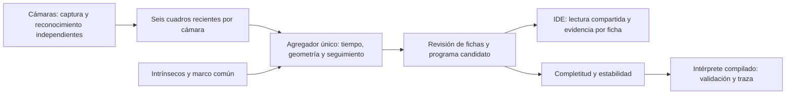

# Cámaras y laboratorio de visión

Estas vistas pertenecen a `vision-prototype`. Usan el intérprete ya compilado del simulador y no modifican el lenguaje SCuLPT.

## Iniciar

Desde `vision-prototype`:

```sh
python3 -m pip install -r requirements.txt
python3 servicio.py
```

Abre <http://127.0.0.1:8766/>. El simulador servido en el puerto 8000 también consulta este servicio en 8766. `--puerto` permite cambiar el puerto del servidor; si lo cambias, abre la interfaz desde ese mismo servicio. Los modelos Three.js todavía necesitan acceso a la CDN del simulador.

Los dispositivos se agregan desde **Cámaras** y se abren al pulsar **Conectar**. Al reiniciar el servicio, quedan desconectados hasta que decidas abrirlos. Las capturas permanecen en memoria; únicamente se guardan configuración, calibraciones y referencias registradas en `datos_locales/`, excluido de Git. Para una sesión aislada usa `--datos /ruta/a/datos`.

## Webcams

1. Conecta las webcams al equipo. Comprueba los permisos de cámara de Python o Terminal en el sistema operativo.
2. Añade cada una por separado, con nombre e índice de dispositivo (0, 1, 2…). El índice depende del sistema y puede cambiar al reconectar USB; comprueba visualmente cuál cámara es antes de reutilizar su calibración.
3. Pulsa **Conectar** y revisa su imagen. Si está ocupada por otra aplicación, ciérrala allí.
4. Calibra y registra las cámaras en un marco común. En **Cámaras → Lectura compartida**, selecciona **Combinar cámaras**, guarda el paso físico medido entre fichas de operación y activa **Actualizar la mesa**.

La lectura compartida asocia observaciones en 3D, conserva identidades de fichas y combina las vistas compatibles. Las similitudes por plantilla son puntuaciones, no probabilidades calibradas. **Una sola vista** conserva el modo anterior por filas, sin fusión. Los detalles y límites están en [FUSION_CAMARAS.md](FUSION_CAMARAS.md).

## Montaje A · RealSense y webcams

Una RealSense aporta RGB y profundidad registrada al color. Las webcams pueden observar caras laterales. El adaptador opcional requiere `librealsense` y `pyrealsense2` compatibles con el sistema; el servicio muestra si falta el módulo. Introduce el serial si hay más de una RealSense.

El servicio conserva profundidad en milímetros e intrínsecos de fábrica. La vista coloreada cubre 0 a 3000 mm; negro representa muestras sin profundidad. La fusión puede usar esa profundidad para localizar las fichas visibles; aún no detecta el cuerpo completo del bloque ni sus conectores.

Referencia del SDK: [alinear profundidad con RGB](https://github.com/realsenseai/librealsense/blob/master/wrappers/python/examples/align-depth2color.py).

## Montaje B · Kinect v2 y webcams

El adaptador implementado es **Kinect v2, de Xbox One**. Kinect de Xbox 360 es v1 y necesita un adaptador distinto, todavía no implementado. Identifica el modelo por su etiqueta o consola de origen antes de instalar controladores.

Para v2 se requieren alimentación, conexión USB 3 y `libfreenect2` con `pylibfreenect2`. No se instalan automáticamente como dependencias básicas. El adaptador usa el procesamiento CPU, registra el color sobre profundidad y conserva intrínsecos del espacio registrado de 512 × 424. Selecciona **Profundidad** para el Kinect y usa webcams cercanas para reconocer símbolos. Introduce el serial para elegir entre varios sensores.

Referencias: [libfreenect2](https://github.com/OpenKinect/libfreenect2), [API pylibfreenect2](https://r9y9.github.io/pylibfreenect2/latest/api.html).

## Calibración

- Usa un tablero físico de ajedrez con medidas conocidas. La configuración cuenta **esquinas interiores**, no casillas: 9 × 6 y casillas de 25 mm son los valores iniciales.
- Para intrínsecos de webcam: inicia la sesión, captura al menos 15 posiciones y ángulos variados y pulsa **Calcular y guardar**. Se rechazan capturas casi iguales y resultados con RMS igual o superior a 1 píxel. Ese umbral es una comprobación básica, no una garantía de precisión métrica.
- Para posición común: fija las cámaras, deja el mismo tablero inmóvil visible para todas y pulsa **Registrar cámaras conectadas**. Cada cámara debe tener intrínsecos. Las imágenes deben estar separadas como máximo 0,5 segundos. Las transformaciones guardadas llevan puntos del tablero a cada cámara: `p_cámara = R · p_tablero + t`, en milímetros.
- La simetría del tablero puede invertir el origen. Mantén una esquina y orientación de referencia identificadas en todas las vistas. Para montajes donde esto no pueda garantizarse, conviene sustituir el tablero por ChArUco o marcadores identificables antes de usar las poses para fusión automática.
- Si cambia la resolución, el dispositivo asociado a un índice o su posición, repite la calibración correspondiente. Recalcular intrínsecos invalida las poses comunes guardadas.

## Símbolos y piezas

**Símbolos** permite registrar una foto recortada por ficha, añadir varias referencias de la misma identidad y comparar una foto con las referencias disponibles. Una pila puede tener cualquier etiqueta o dibujo: nombres Unicode se traducen a identidades deterministas compatibles con el intérprete. Las operaciones siguen siendo las existentes; los literales son números o `nil`.

**Piezas** muestra el inventario del montaje actual, permite girar los seis STL disponibles y descargar los archivos originales. `parametro.stl` contiene la lámina original de operaciones; no es un STL individual para cada parámetro dibujado.

**Ejemplos** contiene diez programas ejecutables, incluidos montajes en arco, herradura y zigzag. Al cargar el primero conserva el montaje previo en memoria para **Restaurar mi montaje**. Recargar o cerrar la página borra esa copia, igual que el estado actual de la mesa.

## Estado compartido y límites



Cada cámara tiene un hilo de captura y un búfer acotado. Un agregador independiente es el único escritor del estado fusionado; la interfaz recibe copias coherentes. Las imágenes se agrupan con hasta 120 ms de separación. Una ficha sin observación reciente permanece provisional y nunca desaparece por un cuadro vacío. Si una vista pierde un símbolo, otra puede mantenerlo localizado con profundidad o con una pareja estéreo suficiente.

La actualización de la mesa es voluntaria. Si está activa y la evidencia deja de ser completa o estable, se conserva el montaje mostrado y se invalida su ejecución hasta una nueva lectura confirmada. Al cambiar a edición manual, se desactiva la actualización por cámaras. **Reiniciar seguimiento** limpia las hipótesis y, si la actualización está activa, el montaje reconstruido; úsalo al retirar piezas o cambiar de escena.

Las conexiones siguen siendo estimaciones por cercanía y dirección de parámetros. La fusión exige una cadena sin ramificaciones y rechaza ciclos o asociaciones ambiguas. No demuestra que haya un encaje físico, ni puede descubrir una ficha nunca visible en ninguna cámara. El reconocimiento de caras, cuerpos y conectores sigue pendiente de un detector específico.

## Verificación

```sh
node --test simulador_3d/*.test.mjs
python3 -m unittest discover -s tests -v
```

Se verifican los ejemplos con el intérprete compilado y las pruebas de fusión, oclusión, movimiento, lecturas contradictorias, geometría curva, obsolescencia, referencias y calibración sintética. Los adaptadores Kinect/RealSense requieren una prueba física en el equipo con sus controladores instalados.

## Vista con gravedad

**Ver con gravedad** inicia una caída vertical de los conjuntos encajados, que se tratan como cuerpos rígidos. Las piezas sueltas caen por separado. El suelo impide que atraviesen la mesa. **Salir de gravedad** restablece las posiciones originales; el montaje y el texto ejecutable no cambian. Esta vista no simula torsión de articulaciones, rotura de uniones ni colisiones entre piezas.

Los ejemplos no lineales usan giros en el plano de la mesa y conservan una secuencia explícita de conexiones. Los saltos del lenguaje determinan la ejecución; la forma de la escultura no añade instrucciones. Los ángulos son configuraciones virtuales y deben verificarse con las tolerancias de las piezas físicas.
