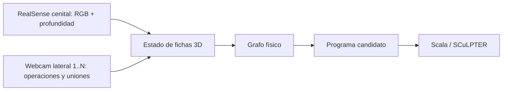
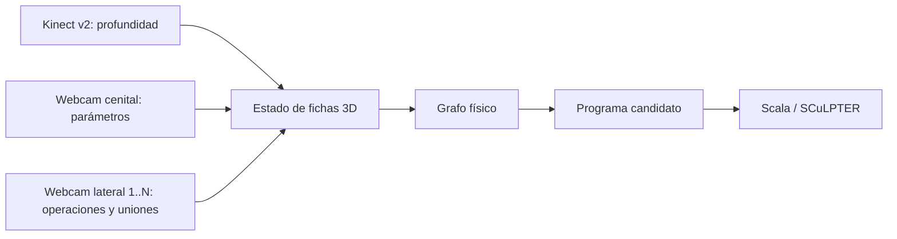
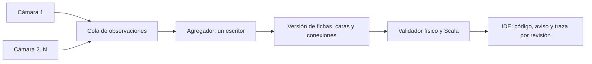

# Montajes para reconstruir SCuLPT en vivo

Este documento describe la arquitectura objetivo. El estado implementado y sus límites están en [FUSION_CAMARAS.md](FUSION_CAMARAS.md); el servicio local ya combina N vistas calibradas con seguimiento conservador de fichas. Los comandos anteriores conservan su funcionamiento: `reconstruir.py` abre una o más webcams sin calibrar y elige una vista completa. `triangulate.py` ya calibra **dos** webcams, empareja lecturas del **mismo lexema** entre ambas, triangula y pasa los puntos a `adjacency.py`. Este último infiere dirección, asigna parámetros y representa un ciclo físico como un `JMP` virtual. Es una base real para seguir trabajando, aunque todavía no combina una operación vista solo a la izquierda con parámetros vistos solo desde arriba, no admite N cámaras calibradas y no mantiene un estado compartido persistente durante el movimiento.

El artículo *The art of programming with SCuLPT* describe cuatro clases de piezas: bloque de código, operación, parámetro y conectores/fijaciones. La operación entra por la abertura superior; los parámetros magnéticos tienen una superficie de melamina con etiquetas libres. Los conectores establecen el flujo desde el extremo plano al esférico, y una unión en T puede formar un ciclo. Por ello la reconstrucción debe conservar identidad de pieza, cara observada y conexión. Una fila de símbolos o la cercanía de dos centros 3D es una aproximación, no una prueba de encaje.

## A. RealSense cenital + webcams laterales

1. Montar rígidamente la RealSense sobre la zona de trabajo y al menos una webcam en ángulo bajo. Añadir más webcams para cubrir caras ocultas, todas con identidad y pose propias.
2. Alinear RGB y profundidad de la RealSense; deproyectar regiones de piezas con los intrínsecos del perfil usado. Estimar el plano de mesa con RANSAC y fijar origen/ejes mediante un patrón visible de calibración en el borde.
3. Calibrar los intrínsecos y la pose de cada webcam respecto a ese marco. Un tablero ChArUco temporal puede servir sin pegar marcadores a las piezas. Comprobar la pose de nuevo si se mueve una cámara.
4. Proyectar cada pieza 3D en las webcams, asociar observaciones a la pieza y cara correspondientes, y registrar también la oclusión y la incertidumbre.

No se requiere triangulación estéreo **externa** para obtener profundidad, pero sí alineación RGB/profundidad y calibración de las webcams laterales. Antes de fijar 40–50 cm, medir cobertura de mesa, píxeles por símbolo y porcentaje de profundidad válida sobre las piezas reales. El adaptador opcional RealSense está disponible en `plataforma/dispositivos.py`; requiere prueba física con el SDK instalado. La estimación RANSAC del plano sigue pendiente: hoy se usa el marco del tablero.

## B. Kinect v2 + webcams lectoras

1. Usar el Kinect para estimar superficies y posiciones, y webcams cercanas para leer símbolos. Registrar RGB/profundidad del Kinect con `libfreenect2`.
2. Calibrar todas las webcams al mismo marco de mesa, proyectar hipótesis 3D sobre cada imagen y asociar la cara visible. La profundidad del Kinect por sí sola no identifica operación ni valor.
3. Medir la resolución efectiva de símbolos de aproximadamente 20 mm con el montaje final. Si falta detalle, acercar las webcams sin cambiar la posición segura del Kinect.

El adaptador opcional Kinect v2 está disponible en `plataforma/dispositivos.py`; requiere prueba física con el controlador instalado. Ambos planes deberían entregar el mismo contrato de observaciones a la reconstrucción. El emparejamiento estéreo actual de `triangulate.py` queda como modo experimental y fuente de funciones reutilizables, especialmente calibración y transformación al marco de mesa.

## Conexión de webcams y estado compartido

Hoy se identifican las cámaras con `herramientas/listar_camaras.py`; `reconstruir.py --camara 0 --camara 1 --camara 2 --servir-3d` abre varias, pero **selecciona una**. `triangulate.py` acepta solo el par `--camera-a` / `--camera-b`. Esos comandos no activan la fusión. Para usar el agregador nuevo, inicia `servicio.py` y selecciona **Combinar cámaras** en la interfaz.

La captura y el reconocimiento pueden ejecutarse en paralelo. Cada cámara produce observaciones con `camera_id`, `frame_id`, instante de captura, caja en píxeles, cara visible, candidatos de lexema y calidad. Un **único agregador** escribe el estado de fichas: enlaza observaciones entre cámaras y a través del tiempo, descarta cuadros atrasados y publica versiones inmutables. Los consumidores leen una revisión completa; no comparten un diccionario mutable entre hilos. La concurrencia se controla así; la decisión difícil es la correspondencia entre vistas y oclusiones. La puntuación de `clasificador_simbolos.py` es similitud, no probabilidad calibrada.

## Validación mientras alguien arma el programa

Cada nueva versión debe revisarse sin esperar a que **toda** la mesa esté quieta. La estabilidad se evalúa por ficha/conexión, con una breve histéresis para que una mano o un cuadro borroso no provoquen avisos intermitentes.

| Estado | Evidencia | Respuesta del IDE |
| --- | --- | --- |
| Construyendo u oculto | Movimiento u oclusión impiden decidir | Mostrar el bloque como provisional y conservar la última ejecución válida. |
| Incompleto | Falta una operación, parámetro o lectura visible | Mostrar la ranura pendiente; `<sin leer>` nunca se convierte en `nil`. |
| Error confirmado | La conexión es imposible o una versión completa y fiable es rechazada por Scala | Advertir sobre la pieza y la razón en esa revisión. |
| Válido | Grafo y texto completos, aceptados por Scala | Mostrar programa y ejecución por pasos, ligados a esa revisión. |

El modelo físico detecta huecos y conexiones imposibles; el lexer/parser Scala da el diagnóstico del lenguaje. Una operación a medio insertar no debe clasificarse como error definitivo. El intérprete debe ejecutarse fuera del ciclo de captura y con presupuesto de pasos para que un `JMP` cíclico no congele el IDE. La retirada automática debe distinguirse de una oclusión total. En la implementación actual se exige **Reiniciar seguimiento** para confirmar un cambio completo de escena; hasta entonces las piezas no observadas permanecen provisionales y la ejecución se pausa.

## Ensayo mínimo antes de elegir hardware

Armar `PUSH S 1` con la operación legible sobre todo desde un lateral y `S`/`1` desde arriba. Registrar antes, durante y después de la inserción; ocultar una cara brevemente; retirar todo al final. Criterios: la misma ficha conserva su identidad entre vistas, el IDE muestra huecos mientras se arma, no lanza un falso error durante la oclusión, valida la versión completa con Scala y limpia el estado al vaciar la mesa. Después repetir con dos operaciones iguales, parámetros repetidos y un conector en T.
